# Hetzner Cloud Ops

**See what changed in your cloud. Preview what changes next.**



A standalone skill for **Codex · Claude Code · Cursor**, backed by a portable Python CLI.
Independent community project; not affiliated with or endorsed by the provider.

## ✨ What it does

- Snapshot six resource families and compare inventory changes with readable Markdown diffs.
- Read through hcloud when available, with an HTTP API alternative and cached-state mode.
- Preview create, power and firewall attachment; require an exact confirmation for deletion. Failed writes are never replayed through another backend.

## 🚀 Install

Requires Node.js **22.20+** for the tested skills installer.

```sh
npx skills@1.7.1 add joeeeeey/hetzner-cloud-ops --agent codex claude-code cursor --yes
```

The implementation is initially delivered in a pull request. Until that PR is merged,
reviewers can install the branch with:

```sh
npx skills@1.7.1 add 'https://github.com/joeeeeey/hetzner-cloud-ops#feat/standalone-skill' --agent codex claude-code cursor --yes
```

Then ask your agent to use **hetzner-cloud-ops**. The standard SKILL.md and bundled CLI are the
portable interface; no dependency on another personal skill is needed.

## 🔎 Try it

From the installed skill directory, or a repository checkout:

```sh
python3 scripts/hz.py list
python3 scripts/hz.py --no-sync diff
python3 scripts/hz.py power stop 123456
```

Python 3.10+. Set `HCLOUD_TOKEN` through your secret manager (legacy `HETZNER_ADMIN_TOKEN` also accepted). Optional `hcloud` CLI; otherwise use `--backend api`. Credentials are never read from a repository config file.

Run `python3 scripts/hz.py --help` for all commands.
Use a secret manager or a private local file for credentials; avoid pasting values into shell history.

## How to use it well

Identify the project token and exact resource ID. Read current inventory and show the concrete plan. Creation, power and firewall changes require user authorization and `--apply`; delete requires `--confirm "CONFIRM DELETE <id>"`. After an uncertain write failure, inspect the target before any retry. Do not infer a resource type or price from old examples.

## 🧪 Compatibility and verification

| Layer | Scope |
| --- | --- |
| Runtime | Python 3.10+; dependency-free standard library helpers |
| Agent interface | Standard SKILL.md + relative scripts; Codex, Claude Code, Cursor |
| Offline verification | Synthetic fixtures and mocks; run `python3 -m unittest discover -s tests -v` |
| Installation / native execution | See [validation evidence](references/validation.md) for exact tested levels |
| Live account operations | Not exercised as part of this release |

The illustration uses declarative SVG animation, with a readable static state and reduced-motion
fallback. It contains no JavaScript, external font or remote image dependencies.

## Limits and data handling

Snapshots include infrastructure metadata and IPs; keep them private. Default commands sync inventory; `--no-sync` reads cached data. No automatic project selection, action polling or cost quote. Creation defaults are conveniences, not a guarantee of stock or price.

Secret-like fields and configured credential values are redacted where supported. Ordinary
resource names, logs and account metadata may still be private: review output before sharing.

[Official documentation and API notes](references/api.md) · [MIT license](LICENSE)

## Provenance

Extracted and maintained from the author's existing local skill implementation, with
account-specific defaults and private operational notes removed. Documentation, fixtures and
SVG artwork in this distribution are original. External runtimes and provider services retain
their own licenses and terms; this repository does not redistribute them.
